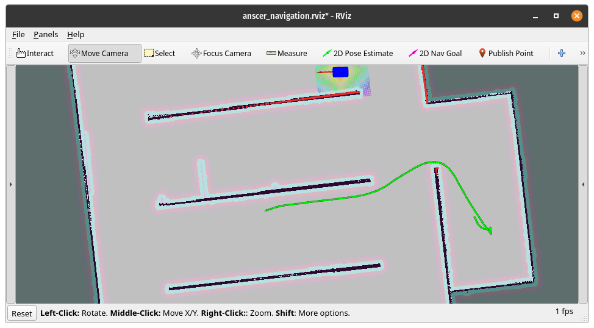

# Trajectory Visualization and Capture

This package contains two ROS nodes:

1. **capture_trajectory_service**: Captures the trajectory of a robot by recording its position and orientation over a specified duration and saves it to a CSV file with the help of tf2_ros::TransformListener that captures the pose of base_link wrt to Odom .
2. **vizualise_trajectory_service**: Visualizes the captured trajectory by reading the CSV file and publishing markers to RViz.

These nodes facilitate the recording and visualization of robot

## Usage 

### Starting the Simulation

1. Start the `AR 100`simulation packages
   ```sh
   roslaunch start_anscer start_anscer.launch
   ```
2. Start the navigation packages
   ```sh
   roslaunch anscer_navigation anscer_navigation.launch map_name:="map"
   ```
3. Add a `Marker_array` display in RViz and set the topic to `/visualization_marker`.

### Capturing the Trajectory

1. Start the `capture_trajectory_service` node:
    ```sh
    rosrun traj_viz capture_service
    ```

2. Call the service to start capturing the trajectory:
    ```sh
    rosservice call /capture_trajectory "{"filename": "trajectory" , "duration" : "30"}"
    ```
    Replace `30` with the desired duration in seconds (NOTE: Enter a integer).
    Change `trajectory` to desired filename

### Visualizing the Trajectory

1. Start the `vizualise_trajectory_service` node:
    ```sh
    rosrun traj_viz viz_service
    ```

2. Call the visualisation service:
    ```sh
    rosservice call /visualize_trajectory "filename: 'trajectory'"
    ```
    Replace trajectory with name of file to be visualised
   

## Pseudocode for ROS Nodes :

### Node 1: Capture Trajectory

1. **Include necessary headers**
    - ROS, standard services, geometry messages, visualization messages, custom services, TF2 listener, and standard libraries.

2. **Define `captureTrajectory` service callback function**
    - Log service call.
    - Extract filename and duration from request.
    - Initialize TF2 buffer and listener.
    - Open a CSV file to save trajectory data.
    - Loop for the specified duration:
      - Try to get the transform between "odom" and "base_link".
      - If successful, write the transform data to the CSV file.
      - If failed, log a warning and retry after a delay.
    - Close the CSV file.
    - Log completion message.
    - Return true.

3. **Define `main` function**
    - Initialize ROS node.
    - Create a service server for "capture_trajectory" using `captureTrajectory` callback.
    - Log readiness message.
    - Spin to keep the node running.

### Node 2: Visualize Trajectory

1. **Include necessary headers**
    - ROS, standard services, geometry messages, visualization messages, custom services, TF2 listener, and standard libraries.

2. **Define `visualiseTrajectory` service callback function**
    - Extract filename from request.
    - Open the corresponding CSV file.
    - Initialize marker ID.
    - Loop through each line in the CSV file:
      - Split the line by commas to extract transform data.
      - Create a marker for each transform.
      - Set marker properties (type, frame, ID, timestamp, namespace, pose, scale, color).
      - Add marker to marker array.
    - Return true.

3. **Define `main` function**
    - Initialize ROS node.
    - Create a service server for "visualize_trajectory" using `visualiseTrajectory` callback.
    - Create a publisher for visualization markers.
    - Log readiness message.
    - Loop while ROS is running:
      - Publish marker array.
      - Spin once to handle callbacks and services.



## Video Demonstration

Watch the video demonstration of the trajectory visualization and capture package:

[](https://www.youtube.com/watch?v=TQM9QLbC3i4)
